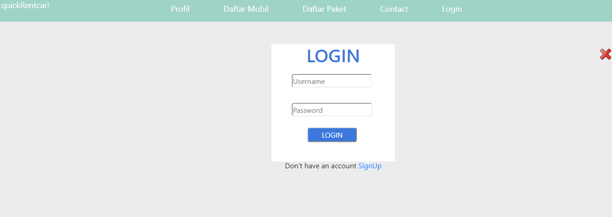
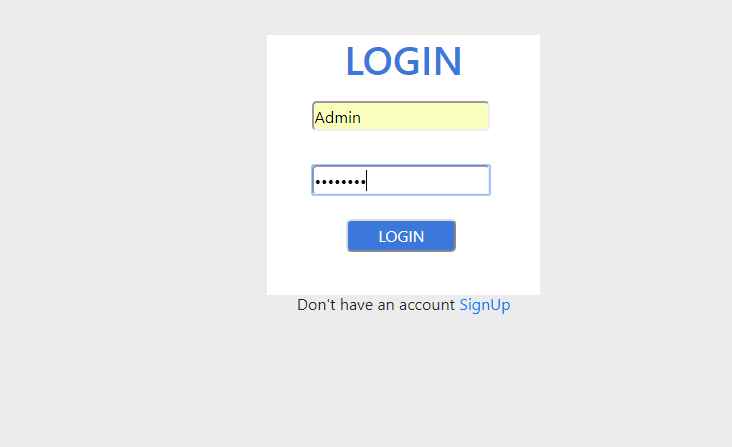
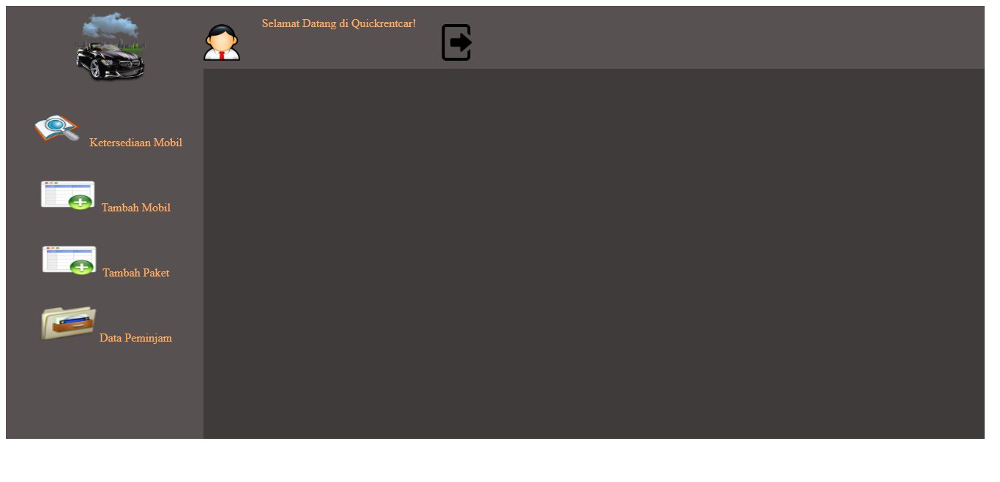
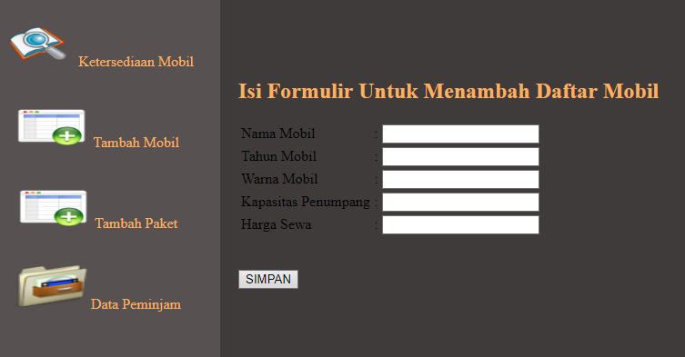
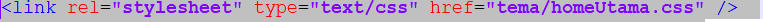
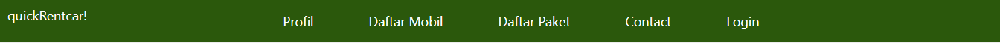
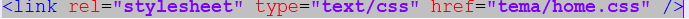
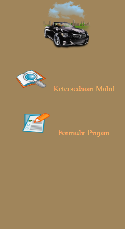
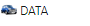

## TUTORIAL
Digunakan untuk menerapkan customization pada **System App Rental** ini. Beberapa topik terpecah menjadi :
	- Menambahkan Mobil Baru
	- Merubah Style (color theme)
	- Mengganti Logo Web (favicon)
	- topik lain (menyusul...)
	
## Tutorial Menambahkan Mobil Baru
Berikut cara untuk _menambahkan mobil baru_ pada perusahaan

**1.** Klik Menu Login pada Landingpage
maka akan muncul seperti gambar dibawah 



**2.** Lalu Login dengan menggunakan _username_ : **Admin** dan _password_ : **admin123**



**3.** Maka setelah Login akan muncul _Menu Utama_ sebagai Admin, seperti berikut ini:



**4.** Lalu pilih menu _Tambah Mobil_



**5.** Lalu isi form sesuai data mobil yang akan ditambahkan

## Tutorial Merubah Style (Color Theme)
Langkah _pertama_ untuk melakukan perubahan warna yaitu:

**1.** Pastikan anda sudah melakukan clone sehingga anda memiliki folder dan file-filenya.

**2.** Jika kalian ingin merubah color theme di **Landingpage** maka yang harus kalian lakukan pertama adalah :

**a.** Buka folder AppRental

**b.** Buka file index.php, lalu lihat mengarah ke tema apa file tersebut, seperti gambar berikut:

		
**c.** Karena disitu tertulis **href="tema/homeUtama.css"**, maka selanjutnya kita buka folder tema dan buka file homeUtama.css

**d.** Lalu kalian bisa melakukan perubahan warna seperti contoh, kita akan _melakukan perubahan warna pada class head_

```
.menuUtama{
background-color:#2b580c;
}
```

**e.** Hasil setelah diubah background-color pada class menuUtama




**3.** Jika kalian ingin merubah color theme di **Home** maka yang harus kalian lakukan pertama adalah :

**a.** Buka folder AppRental

**b.** Buka file home.php, lalu lihat mengarah ke tema apa file tersebut, seperti gambar berikut:

		
**c.** Karena disitu tertulis **href="tema/homeUtama.css"**, maka selanjutnya kita buka folder tema dan buka file home.css

**d.** Lalu kalian bisa melakukan perubahan warna seperti contoh, kita akan _melakukan perubahan warna pada class daftar-menu,contoh seperti berikut:

```
.daftar-menu{
background-color:#a0855b;
}
```

**e.** Hasil setelah diubah background-color pada class daftar-menuAdmin



## Tutorial Mengubah Logo Web (favicon)
Berikut cara untuk merubah Logo:

**1.** Buka file index.php

**2.** Lihat link yg mengarah dia ke images apa


**3.** Lalu jika ingin mengubah maka kita bisa langsung menaruh gambar yang baru dengan syarat **file harus .ico**

```
<link rel="shortcut icon" href="images/logo.ico" />	
```

**4.** Dan berikut hasil perubahannya



		